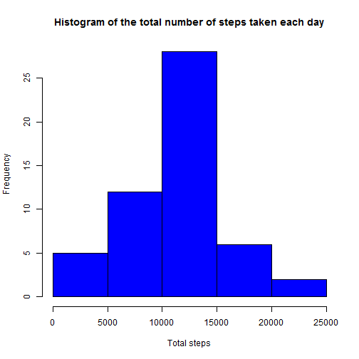
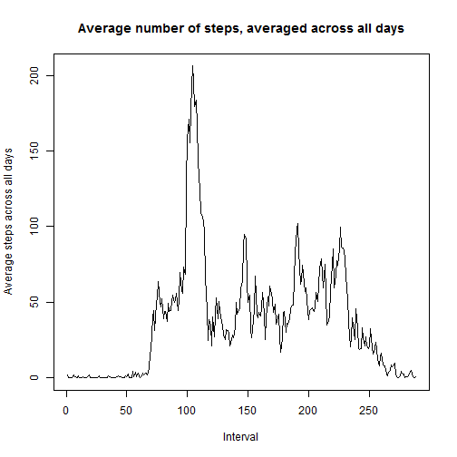
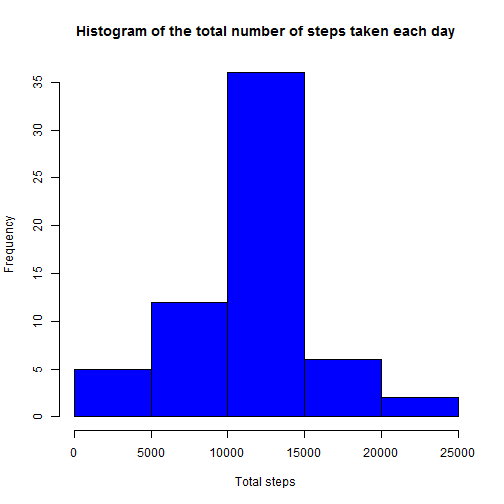
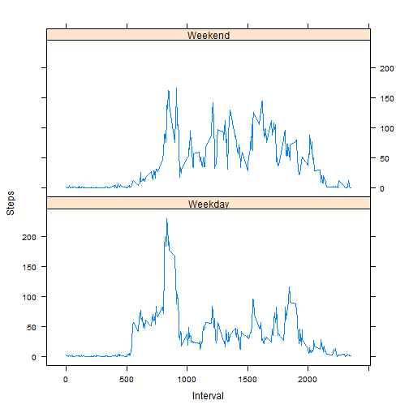

# Reproducible Research: Peer Assessment 1


#### Loading and preprocessing the data


Let's load the activity data and change the date variable format.


```r
data<-read.csv("activity.csv", header=TRUE, sep=",")
data$date<-as.Date(data$date, format="%Y-%m-%d")
```


#### What is mean total number of steps taken per day?


Calculate the total number of steps taken per day.


```r
totalsteps_day<-aggregate(steps~date, data1, sum)
print(totalsteps_day)
```

```
##          date steps
## 1  2012-10-02   126
## 2  2012-10-03 11352
## 3  2012-10-04 12116
## 4  2012-10-05 13294
## 5  2012-10-06 15420
## 6  2012-10-07 11015
## 7  2012-10-09 12811
## 8  2012-10-10  9900
## 9  2012-10-11 10304
## 10 2012-10-12 17382
## 11 2012-10-13 12426
## 12 2012-10-14 15098
## 13 2012-10-15 10139
## 14 2012-10-16 15084
## 15 2012-10-17 13452
## 16 2012-10-18 10056
## 17 2012-10-19 11829
## 18 2012-10-20 10395
## 19 2012-10-21  8821
## 20 2012-10-22 13460
## 21 2012-10-23  8918
## 22 2012-10-24  8355
## 23 2012-10-25  2492
## 24 2012-10-26  6778
## 25 2012-10-27 10119
## 26 2012-10-28 11458
## 27 2012-10-29  5018
## 28 2012-10-30  9819
## 29 2012-10-31 15414
## 30 2012-11-02 10600
## 31 2012-11-03 10571
## 32 2012-11-05 10439
## 33 2012-11-06  8334
## 34 2012-11-07 12883
## 35 2012-11-08  3219
## 36 2012-11-11 12608
## 37 2012-11-12 10765
## 38 2012-11-13  7336
## 39 2012-11-15    41
## 40 2012-11-16  5441
## 41 2012-11-17 14339
## 42 2012-11-18 15110
## 43 2012-11-19  8841
## 44 2012-11-20  4472
## 45 2012-11-21 12787
## 46 2012-11-22 20427
## 47 2012-11-23 21194
## 48 2012-11-24 14478
## 49 2012-11-25 11834
## 50 2012-11-26 11162
## 51 2012-11-27 13646
## 52 2012-11-28 10183
## 53 2012-11-29  7047
```

Make a histogram of the total number of steps taken each day.


```r
hist(totalsteps_day$steps, main="Histogram of the total number of steps taken each day", xlab="Total steps", col="blue")
```

 

Calculate and report the mean and median of the total number of steps taken per day.


The mean is:

```r
mean(totalsteps_day$steps)
```

```
## [1] 10766
```


The median is:

```r
median(totalsteps_day$steps)
```

```
## [1] 10765
```


#### What is the average daily activity pattern?

Make a time series plot (i.e. type = "l") of the 5-minute interval (x-axis) and the average number of steps taken, averaged across all days (y-axis).


```r
average<-tapply(data$steps, data$interval, mean, na.rm=TRUE)
plot(average, type="l", main="Average number of steps, averaged across all days", xlab="Interval", ylab="Average steps across all days")
```

 


Which 5-minute interval, on average across all the days in the dataset, contains the maximum number of steps?


```r
names(which.max(average))
```

```
## [1] "835"
```


#### Imputing missing values


Calculate and report the total number of missing values in the dataset.


```r
sum(is.na(data))
```

```
## [1] 2304
```


Devise a strategy for filling in all of the missing values in the dataset. I will replace by mean in 5-minute interval


```r
average_steps<-aggregate(steps~interval, data, mean)
fill_na<-numeric()
for (i in 1:nrow(data)){
        if(is.na(data[i,]$steps)){
                steps<-subset(average_steps, interval==data[i,]$interval)$steps
        } else {
                steps<-data[i,]$steps
        }
        fill_na<-c(fill_na, steps)
}
```


Create a new dataset that is equal to the original dataset but with the missing data filled in.


```r
data2<-data
data2$steps<-fill_na
```


Make a histogram of the total number of steps taken each day and Calculate and report the mean and median total number of steps taken per day. Do these values differ from the estimates from the first part of the assignment? What is the impact of imputing missing data on the estimates of the total daily number of steps?


```r
totalsteps2<-aggregate(steps~date, data2, sum)
hist(totalsteps2$steps, main="Histogram of the total number of steps taken each day", xlab="Total steps", col="blue")
```

 

```r
mean(totalsteps2$steps)
```

```
## [1] 10766
```

```r
median(totalsteps2$steps)
```

```
## [1] 10766
```


After replacing the NA values the mean is the same, but the median is quite different.


#### Are there differences in activity patterns between weekdays and weekends?


Create a new factor variable in the dataset with two levels - "weekday" and "weekend" indicating whether a given date is a weekday or weekend day.
As my computer is from Brazil, I must change my LC_TIME to english.


```r
Sys.setlocale("LC_TIME", "English")
```

```
## [1] "English_United States.1252"
```

```r
weekday<-weekdays(data2$date)
day<-vector()
for (i in 1:nrow(data2)){
        if (weekday[i]=="Sunday" | weekday[i]=="Saturday"){
                day[i]<-"Weekend"
        } else {
                day[i]<-"Weekday"
        }
}
data2$day<-factor(day)
```


Make a panel plot containing a time series plot (i.e. type = "l") of the 5-minute interval (x-axis) and the average number of steps taken, averaged across all weekday days or weekend days (y-axis)


```r
steps_day<-aggregate(steps~interval+day, data2, mean)
library(lattice)
xyplot(steps~interval | day, steps_day, type="l", layout=c(1,2), xlab="Interval", ylab="Steps")
```

 


